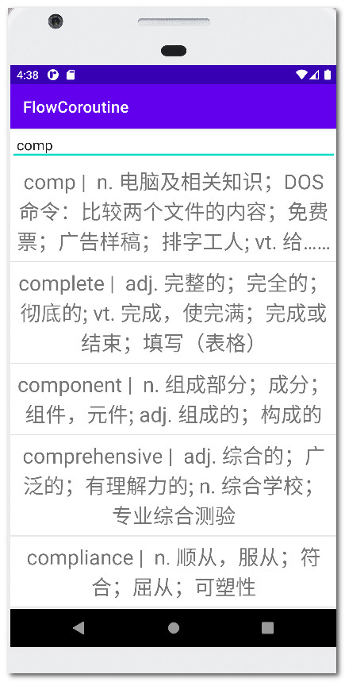
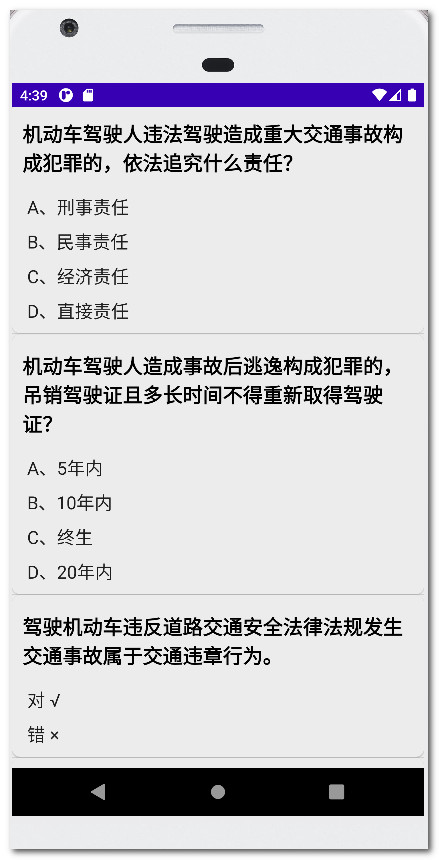

# FlowCoroutine
flow and Coroutine

#### [协程基础相关总结 ☛](.doc/协程基础全貌1.md)

#### [协程上下文总结 ☛](.doc/协程上下文与异常处理2.md)

#### [关于Flow冷流 ☛](.doc/热流Channel.md)

#### [Paging3分页加载 ☛](.doc/paging3.md)

### 代码模块：

| app                                                          | jetpackpaging3                                               | pagingbookstore                                              |
| ------------------------------------------------------------ | ------------------------------------------------------------ | ------------------------------------------------------------ |
|  |  |  |
| SharedFlow， Retrofit2，Room, StateFlow，navigation，coroutines，viewBinding | coroutines，swiperefreshlayout，retrofit2，ViewModel，paging3，flow，Livedata，viewBinding，dataBinding | coroutines，swiperefreshlayout，room，retrofit2，flow，Livedata，ViewModel，Hilt，viewBinding，dataBinding |

